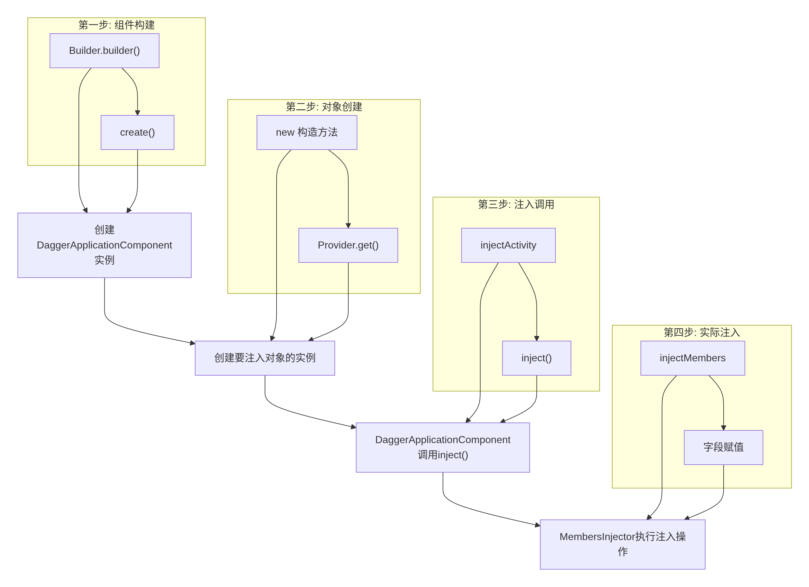

😕 ## 参考网站

markdown语法:https://blog.csdn.net/CyrusCJA/article/details/156235995

> dagger文档     :https://zhuanlan.zhihu.com/p/709431082
>
> dagger视频讲解: https://www.bilibili.com/video/BV1Ki4y1A7hA?spm_id_from=333.788.player.switch&vd_source=980e2e83751098334afa972781a5d387&p=4

### 1. Dagger 基本概念

###### 依赖需求方： 就是需要依赖对象的那些类。 例如一个人想要玩电脑，那么他就必须得有一台电脑，电脑是依赖对象，这个人依赖于这台电脑，因此这个人就是依赖需求方；

###### 依赖供应方：负责提供依赖对象，类似与实际编码中的工厂类。 这个人依赖一台电脑玩游戏，那么就必须有个地方能够提供一台电脑，他可以去实体店买，也可以去网上买，而这个能向这个人提供电脑的地方就是依赖供应方。顾名思义，就是创建依赖对象的地方；

###### 依赖注入器：负责将依赖对象注入到依赖需求方，在实际代码中是一个接口，编译时 Dagger2 会自动生成这个接口的实现类。 接着上面的说，这个人是依赖需求方，他需要一台电脑，依赖供应方能够提供一台电脑，可是这两者没有打通，电脑没有给到这个人，他还是玩不了游戏啊，因此这个时候就需要依赖注入器将这台电脑注入给这个人

### 2. Dagger 导入

` dependencies { implementation 'com.google.dagger:dagger:2.57.2' annotationProcessor 'com.google.dagger:dagger-compiler:2.57.2' }`

1. 依赖需求方

```java
 //Person 类，里面有一个 playGame 的方法，这个方法中要使用 Computer，也就是说，
// Computer 是 Person 的依赖，因此我们使其成为一个成员变量：

public class Person {
    private String name;
    private Computer computer;

    public void Person(String name) {
        this.name = name;  
    }

    public void playGame(String gameName) {
        System.out.print(name + "\n\t");
        computer.play(gameName);
    }
}

//以下是 Computer 类，作为依赖对象，后面我们将通过 Dagger 设置到 Person 中的 computer 成员变量：
    public class Computer {
  
        private String name;
  
        public Computer(String name) {
            this.name = name;
        }
  
        public void play(String game) {
            System.out.println("使用 " + name + " 玩 " + game);
        }
    }
```

2. 依赖供应方

```java
//要找到依赖提供商，并从依赖供应方拿一台电脑。哪里能提供电脑呢？京东、淘宝、实体店都行，这里就先编写一个淘宝类吧
    @Module
    public class TaoBao {
  
        private Computer assembleComputer() {         //组装一台电脑
            Computer computer = new Computer("淘宝组装的电脑");
            return computer;
        }
  
        @Provides
        public Computer getComputer() {
            return assembleComputer();
        }
    }

```

3. 依赖注入器

```java
//有了需求方和供应方，那么就需要将两者连接起来，依赖对象只有从供应方交给需求方，才有意义。这就像厂商生产的商品只有卖给用户，才能发挥商品的作用，经济才能发展。
//那么连接这两者的这就是依赖注入器的工作。在这个例子中，依赖注入器就是快递了，快递把电脑从淘宝店家送到买家手中

//@Component 这个注解的 modules 属性是一个 Class<?>[] 数组，因此可以让依赖注入器指定不止一个依赖供应方。例如，这个例子中，中通不仅可以从淘宝拿电脑进行配送，
    @Component(modules = TaoBao.class)
    public interface ZTOExpress {
        void deliverTo(Person person);
    }
```

### 3. Dagger 提供了两种方式创建依赖对象：

* 调用被 @Inject 注解标识的构造方法
* 调用被 @Module 注解的类中提供相应的 @Provides 方法

### 4. Dagger 提供依赖流程可以概括为如下：

1. 查找 @Module 类中是否存在创建该类的方法
2. 如果存在，查看该方法是否存在参数
   1. 存在参数，则按从步骤1 开始依次初始化每个参数
   2. 不存在参数，则直接初始化该类实例，注入到依赖需求方
3. 如果不存在，则查找该类中被 @Inject 标识的构造方法
   1. 如果构造函数有参数，则按照从步骤1 开始依次初始化每个参数
   2. 如果构造函数没有参数，则直接初始化该类实例，一次依赖注入到此结束

**也就是说，Dagger 提供创建依赖对象的过程是递归的。**

### 5. 作用域

@Scope 范围注解时，一定要注意两点：

> 如果是通过依赖对象的构造函数创建依赖时，需要在类名上添加范围注解，不能在构造函数上添加，否则无效。 - 范围内单例的前提是使用了相同的依赖注入器。

**Dagger作用域限定**

1. 使用作用域注解，可以将某个对象的生命周期限定为其组件的生命周期。这样也就意味着，在作用域范围内，使用到的是同一实例。
2. @Singleton是Dagger提供的一种默认的作用域注解，其意义表示一个单例对象。也就是实例的生命周期和程序运行的生命周期保持一致。
3. 使用@Scope实现自定义作用域注解。
4. 作用域注解使用在@Inject、@Provides、@Binds、@Module、@Component注解上，表示其产生作用的范围。

**使用作用域遵循的一些规则**

1. 使用作用域遵循的一些规则 遵循作用域的使用规则，可以避免很多不必要的问题
2. 在没有必要的情况下，尽量使用默认的作用域，即不指定作用域。
3. 使用作用域注解的模块也只能在带有相同作用域注解的组件中使用。
4. 作用域的指定，必须是上层对下层兼并的关系。这里把上下级分为三层：@Inject/@Provides/@Binds为一层，@Module为第二层，@Component为第三层。如果在上层指定了作用域，那么下层的作用域要么不指定，一旦指定只能保持和上层一致。
5. 开发设计时，一定要有清晰的依赖图，不然很容易产生依赖死循环。

**Dagger组件依赖与子组件**

- 组件依赖与子组件主要解决了不同作用域时组件之间复用问题：
- 在一个组件指定作用域后，就已经确定了该组件创建对象的生命周期。但是有些对象例可能生命周期更短，这个时候就需要定义新的组件。
- 新组件需要使用原组件的部分资源。

**两种方式的实现：**

- 为@Component添加dependencies参数，指定该组件依赖于新的组件。
- 直接使用@Subcomponent注解创建新的组件，并装载到父组件中

## 6. 关键注解：

1. @Inject: 标记需要注入的依赖
2. @Module: 提供依赖的模块
3. @Provides: 在模块中标记提供依赖的方法
4. @Component: 连接模块和注入目标的桥梁
5. @Scope: 定义依赖的作用域（如@Singleton）

## 7. 注解

1. @Module 用于告知 Dagger 这个类是一个依赖提供商，这样 Dagger 才能够识别
2. @Provides 用于告知 Dagger 这个依赖提供商里面哪些方法是用于提供依赖对象的。当 Dagger 需要创建一个依赖对象时，它会查找被 @Module 标识的类中被 @Provides 标识的方法，并根据所需依赖对象的类型，
3. @Component(modules = {TaoBao.class, JD.class})依赖注入器是一个 interface 而非 class，在编译时，Dagger 会生成对应的实现类。 这个接口添加了一个注解：@Component，这个注解是就是告诉注入器，从哪个依赖供应方拿依赖对象。这段代码里，@Component 注解告知了中通，去淘宝这个供应商拿到电脑并快递给买家。
4. @Inject (1.用在成员变量）注解了。Person 类里有 name 和 computer 两个成员变量，从名字上就能看到电脑肯定要配送到 computer 的成员变量上，这个时候需要将 computer 这个成员变量添加 @Inject 注解
5. @Inject (2.用在构造函数）它的作用就是当依赖注入器在所拥有的依赖供应商处查找依赖的提供方法时，如果找不到对应类型的依赖提供方法，那么 Dagger 就会去找这个依赖对象的类型有没有用 @Inject 声明的构造方法，如果有，那就通过这个构造方法生成这个依赖对象
6. @Named 注解了，这个注解使 Dagger 可以在返回值类型一样的情况下，再继续判断 @Named 注解的 value 值
7. @Qualifier 这个单词在英语中就是限定器的意思，顾名思义，在 Dagger 里肯定就是在类型相同时再进一步做个限定。它是一个元注解，@Named 就是继承于它。那我们怎么用这个注解呢？答案就是像 @Named一样，自定义一个注解继承 @Qualifier。 现在我们使用 @Qulifier 实现与上面相同的功能
8. @Singleton 就是 Dagger 可以定义一个某某范围，在这个某某范围内，不会创建多个依赖对象，而是仅创建一个
9. @Scope @Singleton 注解的作用。在这里就表示，通过中通从淘宝上拿到的硬盘都是这一块。但是这样也不太对，中通肯定不止为张三配送，那它为李四配送的时候，岂不是也送的张三的硬盘？ 所以这时候就别用自带的 @Singleton 范围，而是自定义一个范围，也就是使用 @Scope 注解。现在我们就为张三创建一个专属的范围，通过这个例子咱们也会明白 @Scope 的使用
10. @SubComponent 定义子组件、即子依赖注入器 ,如果这个依赖注入器太复杂，那就应该划分为若干个子的依赖注入器，这就要用到 @SubComponent 这个注解了
11. 延迟加载 Lazy 和 强制重新加载 Provider
    12.@Component.Builder  在我们不往 Component 接口中添加 Builder 或 Factory 时，Dagger 模式使用的就是这种构造器模式，但是咱们仍然可以使用这个注解
12. Dagger 还支持 Factory 工厂模式，其使用方式也跟上面的 Builder 类似。但是有一点需要注意的是，同一个 Component 是不能即添加 Builder 也添加 Factory 的
13. Subcomponent.Builder 和 @Subcomponent.Factory 不仅仅是依赖注入器可以添加构造器模式或工厂模式，子组件也可以使用构造器模式或工厂模式。只不是使用的是 @Subcomponent.Builder 和 @Subcomponent.Factory
14. Binds 主要返回接口实例的
15. @BindsInstance：将外部创建的实例（Application）绑定到组件中
16. x

## 8. 对象注入的两种方式

1. 构造函数加 @Inject
2. 类上加 @Module , 类内方法上加Providers 适合不能直接new 对象的情况， 然后要在Component 上装载module

## 9.Dagger 三种核心类分析

1. DaggerXXXComponent：是定义的组件接口实现类，建立依赖关系的桥梁。
2. XXX_MembersInjector：实现了向目标对象执行注入操作。
3. XXX_Factory：创建或者提供注入对象实例的工厂。

## 10.作用域实现原理(DoubleCheck)

1. 编译时验证（编译期） 使用注解处理器（APT）在编译时验证作用域规则 确保相同作用域的组件之间不会发生作用域冲突 检查作用域的生命周期是否合理
2. 运行时缓存（运行期） 通过 DoubleCheck类实现线程安全的单例缓存 使用双重检查锁定（Double-Checked Locking）模式 确保同一作用域内的对象只被创建一次

## 11.module 作用,处理流程与原理

**作用**

1. 将对象的创建逻辑集中管理
2. 提供接口的实现绑定
3. 管理第三方库对象的创建
4. 配置依赖的创建方式

**处理流程**

1. 扫描所有 @Module 注解的类
2. 解析 @Provides 方法
3. 解析 @Binds 方法
4. 生成对应的 Factory 类
5. 在 Component 中集成这些 Factory

**原理**

1. 声明式依赖定义：通过注解声明如何创建对象
2. 编译时代码生成：为每个 @Provides 方法生成 Factory
3. 依赖图构建：自动解析和连接依赖关系
4. 作用域管理：与 Component 协同管理对象生命周期
5. 灵活的模块化：支持 includes、subcomponents 等组织方式

## 12.component 原理和注入流程



## 13.APT

## 18.QA

1. module 是怎么绑定 到component的？
   > @Component(modules = NetModule.class)
   >
2. 对象是怎么绑定到component的？
   > DaggerApplicationComponent.create().inject(this)
   >
3. 可以在不同的compoent中注入同一个对象吗？void inject(InjectFragment injectFragment);
   > 不可以。  怎么解决？ 组件依赖
   >
4. dagger 在编译期间自动生成了哪些代码，而这些代码之间的运行逻辑又是什么 ？
5. dagger 是如何在编译期间生成这些代码的？
6. xx
7. xx
8. xx
9. xx
10. xx
11. xx
12. xx
13. xx
14. xxx
15. xxx
16. xxx
17. xxx
18. xxxx
19. x
