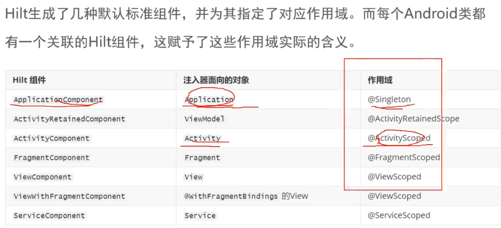

#### 1.Hilt的作用

1. Hilt是Dagger的最强辅助：
2. Hilt简化了Dagger的使用，大量减少了使用Dagger时编写的重复代码。
3. Hilt提供一套标准组件和作用域注解：不必再自定义组件和作用域。
4. Hilt提供几种预定义的绑定（提供对象实例的获取称为绑定）：如Application或Activity。
5. Hilt提供几种预定义的限定符(Qualifier)：@ApplicationContext和@ActivityContext。

#### 2.Hilt中使用Module

```java
@InstallIn(SingletonComponent.class)
@Module
public class AppModule {
    @Provides
    Student provideStudent(){
        return new Student();
    }
}

```
#### 3.默认标准组件

```java
// 在 Application 级别（单例）
@InstallIn(SingletonComponent::class)

// 在 Activity 级别
@InstallIn(ActivityComponent::class)

// 在 Fragment 级别
@InstallIn(FragmentComponent::class)

// 在 View 级别
@InstallIn(ViewComponent::class)

// 在 ViewModel 级别
@InstallIn(ViewModelComponent::class)

// 在 Service 级别
@InstallIn(ServiceComponent::class)
```

#### 4.组件与作用域的关系

#### 5.组件层次结构


#### 6.预定义绑定与限定符


#### 7.Hilt对ViewModel的支持

#### 8.自动生成组件解析

#### 9.Hilt_Application

#### 10.Javassit 动态字节码技术

#### 11.Hilt使用与原理


